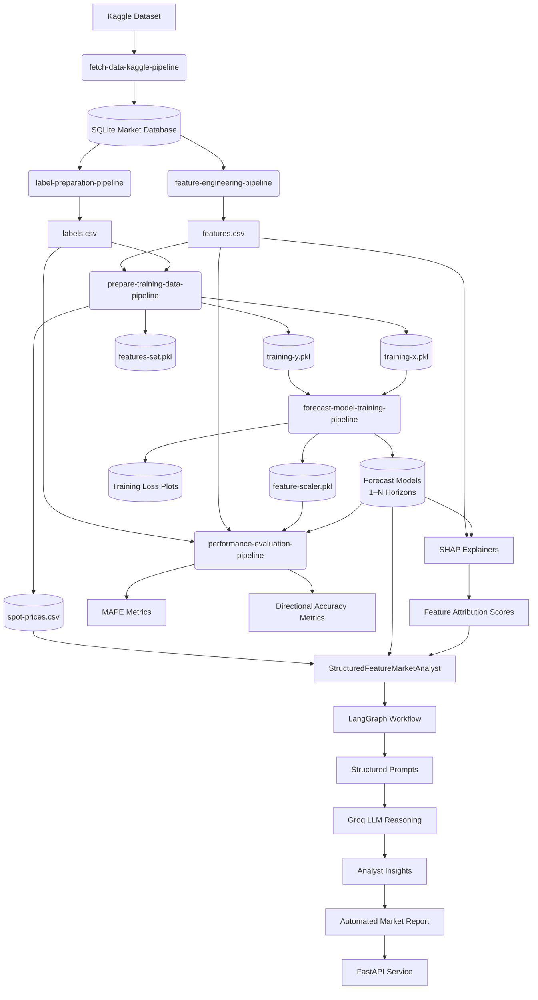

# Autonomous Metal

---

**Autonomous Metal** is an applied AI system that aims to simulate the workflow of a commodity market analyst by combining:

* Market data forecasting
* Feature-driven reasoning
* Explainability analysis
* Automated analyst-style reporting

The project currently focuses on **London Metal Exchange (LME) Aluminum**, but the architecture is designed to generalize to other commodities and structured economic domains.

---

## Project Motivation

Traditional forecasting systems are primarily focused on answering:

> What will happen?

Whereas **real-world analysts** must answer:

> What will happen, and why?

Autonomous Metal is built to bridge this gap by evolving from a predictive machine learning pipeline into an **autonomous analytical system** capable of producing structured market interpretations.

**The goal is not just prediction accuracy, but machine-assisted market reasoning.**

---

## Sample Report

Please refer to `/sample-report-1.md` or `/sample-report-2.md` for a generated analyst report produced using the current system development state.

---

## Repository Design & Goals

```
├── .github/
├── artifacts/
├── core/
├── api/
├── pipelines/
├── .env.example
├── .gitignore
├── LICENSE
├── README.md
├── pyproject.toml
├── requirements.txt
└── sample-report.md
```

The repository is organized to reflect a **modular, production-oriented machine learning system** rather than a notebook-based experimentation project. Each directory represents a distinct responsibility within the autonomous analytical workflow, enabling reproducibility, scalability, and clear separation between data processing, modeling, and reporting components.

The design follows a pipeline-driven architecture where raw market data flows through structured stages:

**ingestion → preparation → feature engineering → forecasting → analytical interpretation**

ultimately producing an automated market report.

## Running the Project

Start the FastAPI service to generate LME Aluminum analyst reports.

```bash
chmod +x run-api.sh
./run-api.sh
```

Once the server starts, open: `http://localhost:8000/docs`

> Ensure `.env` is configured before running the scripts.

---

## Retrain Models (Experiment Pipeline)

Run the full training and experimentation pipeline.

```bash
chmod +x run-experiment.sh
./run-experiment.sh
```

This script executes the complete model retraining workflow, including:

* Feature preparation
* Model training
* Forecast generation
* Artifact updates

> Ensure `.env` is configured before running the scripts.

---

### Design Principles

* **Separation of Concerns**
  Core logic, pipelines, artifacts, and configuration are isolated to maintain clarity and extensibility.

* **Reproducibility**
  Pipelines are structured so datasets and models can be rebuilt consistently.

* **Modularity**
  Components can evolve independently as the system grows toward autonomous analysis.

* **Explainability First**
  Forecasting outputs are designed to be interpretable and directly usable in analyst-style reporting.

* **System-Oriented Development**
  The repository models a complete analytical workflow rather than a standalone ML model.

This structure supports the gradual evolution of the project from a forecasting pipeline into an **autonomous market research assistant** capable of reasoning about market drivers and producing decision-support insights.

---

## Repository Deep Dive

---

### `.github/`

The repository uses a GitHub Actions workflow (`.github/workflows/pylint.yml`) to automatically perform static code analysis using Pylint whenever new code is pushed.

This workflow helps:

* maintain consistent code quality,
* detect potential issues early,
* enforce Python best practices across the project.

---

### `artifacts/`

This directory contains generated outputs produced by machine learning pipelines during training, analysis, and report generation.

Unlike source code, these files represent intermediate and final system results required for:

* reproducibility,
* evaluation,
* downstream analytical workflows.

This directory acts as the system’s **persistent experiment and execution output layer**.

---

### `core/`

The `core` directory contains central logic and reusable system components that power Autonomous Metal.

While pipelines define **when** tasks run, the core module defines **how** the system behaves.

It acts as the application and orchestration layer, providing shared abstractions used across:

* data processing,
* modeling,
* explainability,
* analytical reporting workflows.

---

### `api/`

The `api` directory exposes Autonomous Metal as a service interface, enabling external systems to interact with the analytical engine through structured endpoints.

While the core module defines **how** analytical reasoning and report generation operate, the API layer defines **how users and applications access those capabilities**.

It acts as the system’s interaction layer, responsible for:

* request validation and input handling,
* execution of analyst workflows,
* report generation triggers,
* structured response delivery.

This layer allows Autonomous Metal to function as a deployable AI service, making analyst insights accessible via programmatic interfaces.

---

### `pipelines`

The `/pipelines` directory contains the **execution workflows responsible for orchestrating data movement and model operations** within Autonomous Metal. While the `core` module defines reusable system logic, pipelines define **how and when that logic is executed** across the end-to-end analytical lifecycle.

This layer organizes the project into sequential, reproducible stages that transform raw data into forecasting outputs and analytical artifacts.

Rather than embedding workflow logic directly inside scripts or notebooks, pipelines encapsulate each operational phase of the system into modular execution units, enabling clear separation between computation, orchestration, and reusable intelligence.

Conceptually, the pipeline system implements a structured machine learning lifecycle:

```text
Data Acquisition
        ↓
Label Construction
        ↓
Feature Engineering
        ↓
Training Dataset Preparation
        ↓
Forecast Model Training
        ↓
Performance Evaluation
```

---

## `core/logging.py`

The project implements centralized logging through the `LoggerFactory` class.

Instead of configuring logging separately in each script, the factory ensures all parts of the system share:

* a unified log format,
* standardized output destinations,
* controlled log rotation,
* consistent logging levels.

---

## `core/utils.py`

This module provides foundational components responsible for:

* data acquisition,
* preparation,
* visualization,
* analytical structuring.

It connects raw external datasets with the forecasting and reasoning layers of the system.

Reusable classes encapsulate domain-specific operations required for commodity forecasting and analysis.

### Components Overview

| Component          | Role                                             |
| ------------------ | ------------------------------------------------ |
| `FetchFromKaggle`  | Dataset acquisition and storage                  |
| `PlotHistory`      | Model training visualization                     |
| `PrepareLabels`    | Forecast label generation                        |
| `FetchRawFeatures` | Multi-source feature assembly                    |

---

### `FetchFromKaggle`

**Description**
Handles authenticated dataset downloads from Kaggle and stores them locally for pipeline usage.

**Responsibilities**

* Authenticate with Kaggle API
* Create dataset storage directory
* Download and extract datasets automatically
* Provide structured logging

**Why This Exists**

Commodity modeling relies on external datasets that must remain reproducible across environments.

**Key Features**

* Automatic authentication
* Controlled download path management
* Forced dataset refresh
* Integrated logging

**Typical Workflow**

```python
fetcher = FetchFromKaggle(save_path, "dataset/name")
fetcher.download()
```

---

### `PlotHistory`

**Description**
Visualizes TensorFlow training history using interactive Plotly charts.

**Responsibilities**

* Plot training loss progression
* Plot validation loss
* Enable interactive experiment inspection

**Purpose**

* Detect overfitting
* Validate convergence
* Compare experiments

**Output**

Interactive Plotly figure displaying epoch-wise performance.

---

### `PrepareLabels`

**Description**
Generates supervised learning targets by computing future returns of LME Aluminum prices.

**Responsibilities**

* Load spot price data from SQLite
* Align chronological time-series
* Create forward-looking targets
* Support multiple forecast horizons

**Label Definition**

```
y = (future_price - current_price) / current_price
```

**Output Columns**

| Column             | Description            |
| ------------------ | ---------------------- |
| ssd                | Observation date       |
| current_spot_price | Current aluminum price |
| predicted_for      | Future target date     |
| days_ahead         | Forecast horizon       |
| y                  | Future return label    |

**Purpose**

Forecasting models require forward-looking targets reflecting market movement rather than raw price levels.

---

### `FetchRawFeatures`

**Description**
Aggregates explanatory variables from multiple economic datasets.

**Integrated Data Sources**

* LME Aluminum spot prices
* Google Finance indices
* LME inventory levels
* Baltic Dry Index

**Responsibilities**

* Query SQLite datasets
* Normalize time indices
* Pivot financial indices
* Handle missing values
* Merge into unified dataframe

**Purpose**

Constructs a **macro-aware feature space** combining:

* supply signals,
* logistics indicators,
* financial market conditions.

---

## `core/model.py`

This module provides components responsible for:

* forecast modeling,
* temporal representation learning,
* deterministic multi-horizon prediction.

It serves as the quantitative engine converting engineered market features into forward-looking forecasts.

---

### `AutonomousForecastModelArchitecture`

Implements the core forecasting model: a deterministic CNN for multi-horizon forecasting of multivariate time-series data.

---

#### Forecasting Formulation

For timestamp **T**:

```
Input  (X): [T − lookback + 1 ... T]
Output (y): [T + 1 ... T + horizon]
```

This is **sequence-to-multi-horizon regression**, predicting all future steps in one forward pass.

Advantages:

* avoids error accumulation,
* improves inference stability,
* enables parallel prediction.

---

#### Model Pipeline

```
Historical Feature Window
        ↓
Conv1D Temporal Feature Extraction
        ↓
Batch Normalization
        ↓
Flatten Representation
        ↓
Dense Forecast Projection
        ↓
Multi-Horizon Forecast Output
```

---

### Architectural Decisions

**Conv1D instead of RNN/LSTM**

* parallel computation,
* stable gradients,
* efficient training,
* strong performance on structured time-series.

**GELU Activation**

Improves gradient smoothness and training stability.

**Batch Normalization**

* stabilizes training,
* reduces covariate shift,
* improves convergence.

**Dense Projection Head**

Includes:

* L2 kernel regularization,
* L1 activity regularization.

---

### Directional Penalty Loss

Financial forecasting depends on directional correctness.

Loss combines:

1. Mean Squared Error
2. Directional agreement penalty

```
Final Loss = MSE × Directional Penalty
```

---

### Deterministic Training Controls

* Python, NumPy, TensorFlow seed synchronization
* `TF_DETERMINISTIC_OPS=1`
* GPU disabled (`CUDA_VISIBLE_DEVICES="-1"`)

Note: Full bitwise determinism cannot be guaranteed due to floating-point behavior.

---

### Training Configuration

| Component | Configuration            |
| --------- | ------------------------ |
| Optimizer | Adam                     |
| Loss      | Directional Penalty Loss |
| Metric    | Mean Squared Error       |

Early stopping:

```python
EarlyStopping(
    monitor="val_loss",
    patience=10,
    restore_best_weights=True
)
```

Benefits:

* prevents overfitting,
* reduces unnecessary training,
* restores best model automatically.

---

### Usage

**Initialization**

```python
model = AutonomousForecastModelArchitecture(
    seed=42,
    input_horizon_space=60,
    input_feature_space=12,
    output_horizon_space=10
)
```

**Training**

```python
model.fit(X_train, y_train, validation_data=(X_val, y_val))
```

**Prediction**

```python
predictions = model.predict(X_test)
```

**Saving & Loading**

```python
model.save("artifacts/model.keras")

loaded_model = AutonomousForecastModelArchitecture.load(
    "artifacts/model.keras"
)
```

---

## `core/graph.py`

Provides components responsible for:

* model explainability interpretation,
* feature-level reasoning,
* automated analyst report generation.

Transforms forecasts and SHAP explanations into structured economic narratives.

---

### Conceptual Workflow

```
Forecast Models
        ↓
SHAP Explainability
        ↓
Structured Feature Analyst
        ↓
LLM Reasoning
        ↓
Automated Market Report
```

---

### Key Components

| Component                        | Role                             |
| -------------------------------- | -------------------------------- |
| `FeatureInsight`                 | Structured analyst output schema |
| `FeatureAnalystState`            | Workflow state container         |
| `StructuredFeatureMarketAnalyst` | Main orchestration engine        |

---

### `FeatureInsight`

Structured Pydantic schema containing:

* feature_name
* feature_behavior
* shap_interpretation
* forecast_alignment
* influence_strength
* analyst_explanation

Ensures reproducible structured outputs.

---

### `FeatureAnalystState`

Stores workflow state:

* market metadata,
* forecasts,
* feature time-series,
* SHAP results,
* generated insights.

---

### `StructuredFeatureMarketAnalyst`

Central orchestration engine.

**Responsibilities**

* Load forecast models
* Initialize SHAP explainers
* Generate forecasts
* Compute attribution
* Invoke LLM reasoning
* Produce analyst reports

---

### LangGraph Workflow

```
get_feature_information
        ↓
get_feature_timeseries
        ↓
get_forecasting
        ↓
get_shap_scores
        ↓
get_llm_insight
        ↓
END
```

---

### LLM Reasoning Layer

* Groq-hosted model via LangChain
* deterministic temperature (0)
* structured prompts
* schema-validated outputs

Prevents hallucinated structure and maintains machine-readable outputs.

---

### Analyst Report Generation

Uses:

```
StructuredAnalystReportPrompt
```

Synthesizes:

* forecast trajectories,
* feature influence,
* economic context,
* market interpretation.

---

## `core/prompt.py`

Provides structured language-model interaction and analytical constraint enforcement.

Transforms structured signals into controlled institutional-style reports.

---

### Purpose

* enforce reasoning boundaries,
* prevent hallucinations,
* standardize analyst communication,
* produce institutional-quality reports.

---

### Architectural Role

```
Forecast Models
        ↓
SHAP Explainability
        ↓
Structured Feature Analyst
        ↓
Prompt Layer
        ↓
LLM Output
        ↓
Market Research Report
```

---

### Design Philosophy

1. **Constrained Intelligence** — LLM interprets model outputs only.
2. **Structured Outputs** — schema-driven responses.
3. **Analyst-First Communication** — institutional commentary style.

---

### Components

| Component                       | Role                             |
| ------------------------------- | -------------------------------- |
| `StructuredSystemPrompt`        | Global behavioral rules          |
| `StructuredUserPrompt`          | Data-driven analytical context   |
| `StructuredAnalystReportPrompt` | Final report generation template |

---

### `StructuredSystemPrompt`

Defines the behavioral contract:

* interpret model behavior only,
* prohibit independent forecasting,
* restrict speculative reasoning,
* enforce institutional tone.

Core rule:

> The forecast already exists and is final — explanation only.

---

### `StructuredUserPrompt`

Injects structured analytical evidence:

* analysis date,
* current price,
* forecast trajectory,
* feature metadata,
* historical behavior,
* SHAP signals.

Separates:

* interpretation authority → models
* narrative explanation → LLM

---

### `StructuredAnalystReportPrompt`

Generates the final institutional research report.

**Responsibilities**

* aggregate feature insights,
* produce sell-side research style output,
* maintain professional tone.

**Required Structure**

```
# LME Aluminum Market Outlook Report
## Executive Summary
## Key Market Insight
## Aluminum Market Fundamentals
...
## Conclusion
```

Ensures consistent formatting suitable for publication or automated distribution.

---

## `api/main.py`

This module exposes Autonomous Metal as a deployable analytical service using FastAPI.

It acts as the system’s external interface, transforming analyst workflows into accessible API endpoints that allow programmatic report generation.

The API layer connects user requests with the internal reasoning engine, ensuring validated inputs, controlled execution, and structured responses.

### Responsibilities

* Load and validate runtime configuration
* Initialize service-level dependencies
* Validate analytical request constraints
* Trigger analyst workflow execution
* Return structured markdown reports
* Provide operational logging and error handling

The module converts Autonomous Metal from an offline analytical system into a callable AI service.

---

### Components Overview

| Component | Role |
|----------|------|
| `FastAPI Application` | Service interface for report generation |
| `ReportRequest` | Input schema validation |
| `validate_friday` | Date constraint enforcement |
| `create_report` | Analyst workflow execution endpoint |

---

### FastAPI Application

**Description**

Initializes the Autonomous Metal API service and defines metadata used for service documentation.

**Responsibilities**

* Configure API metadata
* Enable automatic OpenAPI documentation
* Expose analyst functionality through REST endpoints

**Output**

Interactive API documentation available at:

```
/docs
```

---

### `ReportRequest`

**Description**

Defines the request schema for report generation using Pydantic validation.

**Responsibilities**

* Enforce structured input format
* Validate required fields before execution
* Provide automatic API documentation examples

**Input Fields**

| Field | Description |
|------|-------------|
| `friday_date` | Target report date in `YYYY-MM-DD` format |

**Purpose**

Ensures all analyst requests follow a consistent and validated structure before entering the analytical pipeline.

---

### `validate_friday`

**Description**

Validates temporal constraints required by the forecasting system.

**Responsibilities**

* Parse incoming date strings
* Ensure correct format (`YYYY-MM-DD`)
* Enforce Friday-only execution
* Restrict requests to supported historical range

**Validation Rules**

| Rule | Requirement |
|------|------------|
| Format | `YYYY-MM-DD` |
| Day | Must be Friday |
| Range | Between 2015-01-14 and 2026-02-05 |

**Purpose**

Forecasting models operate on weekly market structure aligned with Friday settlement logic.
This validator guarantees temporal consistency across all analytical executions.

---

### `create_report`

**Description**

Primary API endpoint responsible for generating analyst-style markdown reports.

**Execution Flow**

1. Receive validated request payload
2. Perform temporal validation
3. Initialize `StructuredFeatureMarketAnalyst`
4. Execute structured reasoning workflow
5. Generate markdown analyst report
6. Return structured API response

**Responsibilities**

* Orchestrate analyst pipeline execution
* Inject configuration and artifact dependencies
* Handle runtime failures safely
* Provide execution logging

**Response Structure**

```json
{
  "status": "success",
  "report_date": "YYYY-MM-DD",
  "markdown_report": "Generated analyst report"
}
```

**Purpose**

Transforms Autonomous Metal into an on-demand analytical engine capable of producing structured market insights through a simple API call.

---

## `pipeline/fetch-data-kaggle-pipeline.py`

### Purpose

This pipeline ensures that required datasets are programmatically retrieved from Kaggle before any downstream processing begins.

Rather than relying on manual dataset downloads, this stage guarantees reproducibility across environments and machines.

### Responsibilities

* Load environment configuration from `.env`
* Initialize centralized logging
* Retrieve dataset identifier from environment variables
* Download and extract datasets using `FetchFromKaggle`

### Execution Flow

```text
Load Environment Variables
        ↓
Initialize Logger
        ↓
Fetch Dataset from Kaggle
        ↓
Store Dataset Locally
```

### Architectural Role

This pipeline acts as the **data ingestion entry point** of Autonomous Metal.
All subsequent pipelines assume dataset availability provided by this stage.

### Design Rationale

Commodity forecasting systems depend on external datasets that must remain consistent across experiments. Automating acquisition eliminates manual setup errors and ensures reproducible experimentation.

---

## `pipeline/label-preparation-pipeline.py`

### Purpose

Constructs supervised learning targets required for forecasting by generating forward-looking return labels from historical LME Aluminum prices.

### Responsibilities

* Load database connection
* Initialize `PrepareLabels`
* Generate multi-horizon forecast targets
* Persist labels as structured CSV output

### Execution Flow

```text
Load Environment Configuration
        ↓
Connect to SQLite Market Database
        ↓
Generate Future Return Labels
        ↓
Save labels.csv
```

### Output

* `dataset/labels.csv`

Contains future-return targets aligned with forecast horizons.

### Architectural Role

This pipeline converts raw historical price data into **model-ready prediction targets**, bridging raw market data and supervised learning.

### Design Significance

Instead of predicting raw prices, Autonomous Metal forecasts *returns*, allowing models to learn directional and proportional market movement.

---

## `pipeline/feature-engineering-pipeline.py`

### Purpose

Aggregates and prepares explanatory variables from multiple economic datasets into a unified feature matrix.

### Responsibilities

* Connect to SQLite data source
* Extract macroeconomic and market signals
* Normalize and merge datasets
* Persist engineered features

### Execution Flow

```text
Connect to Database
        ↓
Fetch Raw Market Features
        ↓
Merge Multi-Source Signals
        ↓
Save features.csv
        ↓
Store Artifact Copy
```

### Outputs

* `dataset/features.csv`
* `artifacts/features.csv`

### Architectural Role

This pipeline constructs the **explanatory feature space** used by forecasting models.

It represents the transformation from isolated datasets into a macro-aware representation of commodity markets.

### Design Rationale

Commodity price dynamics depend on interconnected economic signals. Centralizing feature construction ensures consistency between training, evaluation, and explainability workflows.

---

## `pipeline/prepare-training-data-pipeline.py`

### Purpose

Transforms engineered features and labels into structured temporal training datasets suitable for sequence-based forecasting models.

### Responsibilities

* Load features and labels
* Sort chronologically
* Construct sliding temporal windows
* Align inputs with forecast horizons
* Serialize training artifacts

### Execution Flow

```text
Load Features & Labels
        ↓
Determine Feature Ordering
        ↓
Construct Lagged Time Windows
        ↓
Align Inputs with Targets
        ↓
Serialize Training Data
```

### Generated Artifacts

| Artifact           | Purpose                     |
| ------------------ | --------------------------- |
| `training-x.pkl`   | Model input sequences       |
| `training-y.pkl`   | Forecast targets            |
| `features-set.pkl` | Feature ordering metadata   |
| `spot-prices.csv`  | Historical reference prices |

### Architectural Role

This stage converts tabular datasets into **temporal tensors**, enabling convolutional sequence learning.

### Important Design Choice

Training samples are constructed using a fixed lag window (`LAG_WINDOW`) to ensure consistent temporal context across all forecasts.

This design directly supports deterministic multi-horizon modeling implemented in `core/model.py`.

---

## `pipeline/forecast-model-training-pipeline.py`

### Purpose

Trains forecasting models responsible for predicting future aluminum price movements across multiple forecast horizons.

### Responsibilities

* Load prepared training datasets
* Apply feature scaling using `RobustScaler`
* Train individual models per forecast horizon
* Monitor training metrics
* Save trained models and training diagnostics

### Execution Flow

```text
Load Training Data
        ↓
Scale Features (RobustScaler)
        ↓
Train Model for Each Horizon
        ↓
Track Training Metrics
        ↓
Save Model + Loss Plots
```

### Key Operations

#### Feature Scaling

Input tensors are reshaped into 2D form for scaling, then reconstructed into temporal format:

```text
3D (samples, steps, features)
        ↓ reshape
2D scaling
        ↓ reshape
3D temporal tensor
```

RobustScaler is used to reduce sensitivity to financial outliers.

#### Multi-Horizon Training Strategy

Instead of a single multi-output model, this pipeline trains **independent models for each forecast horizon**, improving specialization and stability.

### Generated Artifacts

* Forecast models:

  ```
  lme-al-forecast-model-{N}-days-ahead.keras
  ```
* Training loss visualizations
* Feature scaler (`feature-scaler.pkl`)

### Architectural Role

This pipeline represents the **quantitative learning stage** of Autonomous Metal — where engineered market signals become predictive intelligence.

---

## `pipeline/performance-evaluation-pipeline.py`

### Purpose

Evaluates trained forecasting models using historical backtesting to measure prediction accuracy and directional performance.

### Responsibilities

* Load trained models and scaler
* Reconstruct sliding windows
* Generate batch predictions
* Align predictions with ground truth labels
* Compute evaluation metrics

### Execution Flow

```text
Load Features & Labels
        ↓
Rebuild Sliding Windows
        ↓
Scale Inputs
        ↓
Run Forecast Predictions
        ↓
Align Predictions with Targets
        ↓
Compute Metrics
```

### Evaluation Metrics

#### Mean Absolute Percentage Error (MAPE)

Measures price prediction accuracy:

```text
APE = |Predicted − Actual| / Actual
```

#### Directional Accuracy (DA)

Measures whether the model correctly predicts market direction:

```text
DA = sign(prediction) == sign(actual)
```

### Output Analysis

Performance statistics are aggregated by:

* forecast horizon,
* training vs validation period.

Pivot tables are logged for analytical inspection.

### Architectural Role

This pipeline validates whether forecasting models provide **economically meaningful predictions**, not just numerical accuracy.

### Design Importance

Financial forecasting depends heavily on directional correctness. Evaluating both magnitude error and directional accuracy aligns performance measurement with real-world analyst expectations.

---

## Pipeline Architecture Summary

Together, the pipelines implement a fully reproducible analytical lifecycle:

```text
Kaggle Data Fetch
        ↓
Label Construction
        ↓
Feature Engineering
        ↓
Temporal Training Dataset Creation
        ↓
Forecast Model Training
        ↓
Performance Evaluation
        ↓
Explainability + Analyst Reasoning (core/graph.py)
```

This separation between **execution pipelines** and **core analytical logic** enables Autonomous Metal to evolve toward a scalable autonomous market intelligence system.

---

# Forecast Model Performance (Current Benchmark)

The forecasting system has reached a stable performance baseline after extensive architectural experimentation, hyperparameter tuning, and repeated out-of-sample evaluation.

Evaluation follows a **strict chronological split**, ensuring realistic forward-looking performance consistent with real trading environments where future data is never available during training.

The model performs **direct multi-horizon forecasting** using a fixed historical lookback window across fourteen market drivers.

---

## Evaluation Setup

**Forecast configuration**

* Forecast horizons: **1–5 trading days ahead**
* Targets derived from predicted returns rather than raw price levels
* Fixed lag-window temporal input representation

**Evaluation metrics**

* **MAPE (Mean Absolute Percentage Error)** — measures price prediction accuracy
* **Directional Accuracy** — measures correctness of predicted price movement

Directional accuracy is emphasized because practical market usefulness depends primarily on predicting whether prices move **up or down**, rather than minimizing numerical deviation alone.

---

## Final Model Performance

### Price Forecast Accuracy (MAPE)

| Days Ahead | Train | Validation |
| ---------- | ----- | ---------- |
| 1          | 0.87% | **0.96%**  |
| 2          | 1.23% | **1.23%**  |
| 3          | 1.56% | **1.46%**  |
| 4          | 1.95% | **2.24%**  |
| 5          | 2.21% | **2.22%**  |

The results demonstrate stable generalization across forecast horizons, with validation performance closely tracking training error — indicating minimal overfitting.

---

### Directional Accuracy (Primary Metric)

| Days Ahead | Train | Validation |
| ---------- | ----- | ---------- |
| 1          | 63.3% | **57.4%**  |
| 2          | 63.5% | **58.0%**  |
| 3          | 62.6% | **60.5%**  |
| 4          | 56.0% | **58.5%**  |
| 5          | 55.8% | **58.3%**  |

Directional accuracy remains consistently above random-walk behavior across all horizons.

---

## Interpretation Relative to Market Standards

Financial markets exhibit extremely low signal-to-noise ratios and near-random short-term dynamics. Even small predictive advantages are statistically meaningful.

Typical interpretation benchmarks:

| Accuracy   | Interpretation                      |
| ---------- | ----------------------------------- |
| ~50%       | Random walk                         |
| 52–55%     | Weak predictive signal              |
| 55–58%     | Strong machine learning performance |
| **58–61%** | Research-level forecasting          |

Autonomous Metal achieves approximately **57–60% directional accuracy**, placing performance within modern deep-learning commodity forecasting ranges reported in applied quantitative research.

---

# Model Architecture

The forecasting model is a lightweight temporal convolutional network designed specifically for noisy financial time-series environments.

```text id="arch1"
Input (lookback × features)
        ↓
Conv1D (temporal feature extraction)
        ↓
Batch Normalization
        ↓
Flatten Projection
        ↓
Regularized Dense Forecast Head
```

---

## Architectural Rationale

### Temporal Convolution

Captures short-term momentum and micro-trend patterns while remaining computationally efficient and stable compared to recurrent architectures.

### Batch Normalization

Helps stabilize optimization under non-stationary market distributions and shifting volatility regimes.

### Flatten Projection

Acts as a compact aggregation mechanism, avoiding high-capacity recurrent models that frequently overfit limited financial datasets.

### Regularized Forecast Head

Combines:

* **L2 weight regularization** — controls parameter magnitude
* **L1 activity regularization** — encourages sparse signal utilization

The `tanh` output activation bounds predictions and stabilizes return forecasting.

---

# Directional Penalty Loss

Financial usefulness depends heavily on predicting **direction**, not only magnitude.

The model therefore uses a custom optimization objective:

```python
def _directional_penatly_loss(y_true, y_pred, sample_weight=None):
    mse = tf.keras.losses.mean_squared_error(y_true, y_pred)

    directional_accuracy = tf.reduce_mean(
        tf.cast(tf.equal(tf.sign(y_true), tf.sign(y_pred)), tf.float32)
    )

    directional_penalty = 2 / (1 + directional_accuracy)

    return mse * directional_penalty
```

---

## Conceptual Motivation

This loss dynamically adjusts optimization pressure:

* Correct directional prediction → smaller penalty
* Incorrect directional prediction → stronger corrective gradients
* Magnitude learning preserved through the MSE backbone

The objective aligns gradient updates with economically meaningful prediction behavior rather than purely numerical optimization.

---

# Training Dynamics

Training convergence behavior can be inspected through loss curves stored in:

```text id="arch2"
/artifacts/loss-plot-{days_ahead}-days-ahead.png
```

Observed characteristics:

* Rapid early convergence
* Smooth validation improvement
* No late-stage divergence
* Consistent behavior across forecast horizons

These patterns suggest learning of persistent market structure rather than memorization of historical noise.

---

## Market Interpretation

Observed predictive structure aligns with known commodity market dynamics:

* **1-day horizon**
  Dominated by market microstructure noise and short-term randomness.

* **2–3 day horizons**
  Exhibit the strongest predictive signal, where informational momentum persists.

* **4–5 day horizons**
  Show gradual information decay as uncertainty compounds over time.

This behavior closely matches empirical findings in commodity and financial market forecasting literature.

---

# Technology Stack

Autonomous Metal is designed as a **system-oriented applied AI platform** rather than a single machine learning experiment.
The technology stack reflects this philosophy by combining reproducible data engineering, deterministic deep learning, explainability tooling, and structured LLM reasoning into a unified analytical workflow.

The stack prioritizes:

* reproducibility,
* modular experimentation,
* deterministic execution,
* explainable forecasting,
* production-oriented research development.

## Programming Language

### Python

Python serves as the primary implementation language across the entire system.

It enables tight integration between:

* machine learning frameworks,
* data processing pipelines,
* explainability tooling,
* LLM orchestration frameworks.

The repository follows a modular Python package structure rather than notebook-driven experimentation.

---

## Machine Learning & Deep Learning

### TensorFlow / Keras

Used for building and training forecasting models implemented in `core/model.py`.

Responsibilities:

* Temporal convolutional neural networks (Conv1D)
* Deterministic training configuration
* Custom loss function implementation
* Model serialization and loading

Key motivations:

* Stable production-ready APIs
* Strong support for custom training objectives
* Reliable model export and reproducibility

---

### NumPy

Provides numerical tensor operations used throughout:

* dataset preparation,
* tensor reshaping,
* sliding window generation,
* prediction aggregation.

---

### Scikit-learn

Used primarily for preprocessing and scaling:

* `RobustScaler` applied to financial features to reduce sensitivity to market outliers.

Financial datasets frequently contain extreme values; robust scaling improves training stability.

---

## Data Processing & Storage

### Pandas

Central data manipulation framework used for:

* time-series alignment,
* feature merging,
* label construction,
* evaluation analytics,
* pivot-table performance summaries.

---

### SQLite

Acts as the structured storage backend for raw market datasets.

Advantages:

* lightweight local database,
* reproducible dataset snapshots,
* SQL-based querying during feature engineering.

SQLite enables deterministic dataset reconstruction without requiring external infrastructure.

---

### Kaggle API

Used for automated dataset acquisition through the ingestion pipeline.

Responsibilities:

* authenticated dataset downloads,
* reproducible environment setup,
* automated dataset refresh.

This eliminates manual data dependency management.

---

### FastAPI

Provides the service interface that exposes Autonomous Metal’s analytical engine as a deployable API.

Advantages:

* high-performance asynchronous web framework,
* automatic request validation using Pydantic schemas,
* built-in OpenAPI documentation,
* lightweight deployment for ML inference services.

FastAPI enables analyst report generation through structured HTTP endpoints, allowing external systems and users to interact with the forecasting and reasoning pipeline programmatically.

---

## Explainability & Model Interpretation

### SHAP (SHapley Additive Explanations)

Provides feature attribution analysis for forecasting models.

Within Autonomous Metal, SHAP is used to:

* quantify feature contribution,
* explain model behavior across forecast horizons,
* provide structured evidence for analyst reasoning.

SHAP outputs form the bridge between numerical predictions and narrative market interpretation.

---

## LLM Reasoning & Agent Workflow

### LangChain

Provides structured interaction with large language models.

Responsibilities:

* prompt templating,
* structured output parsing,
* controlled reasoning pipelines.

LangChain allows LLMs to operate as constrained analytical components rather than free-form generators.

---

### LangGraph

Used to construct deterministic reasoning workflows.

Implements execution graphs such as:

```text
Feature Context
        ↓
Forecast Generation
        ↓
SHAP Attribution
        ↓
LLM Interpretation
        ↓
Analyst Insight
```

This converts analytical reasoning into a reproducible state-driven pipeline.

---

### Groq LLM Inference

The system integrates Groq-hosted language models for fast inference during analyst report generation.

Configuration characteristics:

* deterministic temperature settings,
* schema-constrained outputs,
* structured analytical prompting.

The LLM functions strictly as an interpretation engine rather than a predictive model.

---

## Visualization & Diagnostics

### Plotly

Used to visualize model training dynamics.

Generated artifacts include:

* loss curves,
* convergence inspection plots,
* experiment comparison visuals.

Interactive visualization supports debugging and experimental validation.

---

## Experiment Tracking & Artifacts

### Pickle Serialization

Used for storing intermediate system artifacts:

* training tensors,
* feature ordering metadata,
* scalers,
* prepared datasets.

This enables deterministic reconstruction of experiments.

---

### Artifact-Based Workflow

The `/artifacts` directory functions as a lightweight experiment registry containing:

* trained models,
* feature scalers,
* evaluation outputs,
* visualization assets.

This design mimics production ML workflows without requiring external experiment tracking services.

---

## API & Application Layer (In Progress)

### FastAPI

Planned for serving forecasting and analyst reports as programmatic endpoints.

Expected capabilities:

* forecast retrieval,
* automated report generation,
* integration with external analytical systems.

---

## Development & Infrastructure

### GitHub Actions

Automated workflows perform static code analysis using Pylint on repository updates, maintaining code quality and consistency.

---

### Environment Configuration

* `.env` based configuration management
* `python-dotenv` for environment loading

Allows separation of:

* dataset identifiers,
* forecast parameters,
* runtime configuration.

---

## Design Philosophy Behind the Stack

The technology choices intentionally avoid heavyweight infrastructure while preserving production realism.

Key principles:

* **Local-first reproducibility** — experiments run deterministically on a single machine.
* **Explainability-native modeling** — interpretability is integrated, not added later.
* **Pipeline-driven execution** — mirrors real ML systems.
* **Controlled AI reasoning** — LLMs operate under strict analytical constraints.

Together, the stack enables Autonomous Metal to function as a **prototype autonomous commodity analyst**, combining statistical forecasting with structured machine reasoning.

# System Technical Architecture


 ---

 # Dataset: LME Aluminum Forecasting Dataset (Explainability)

Autonomous Metal is built upon a purpose-designed dataset created specifically for **explainable short-term commodity forecasting**.

The dataset used throughout the system is publicly available on Kaggle:

👉 [LME Aluminum Forecasting Dataset — Explainability](https://www.kaggle.com/datasets/tanulkumarsrivastava/lme-aluminum-forecasting-dataset-explainability?utm_source=chatgpt.com)

This dataset was constructed to enable **data-driven forecasting and explainability for short-term movements in London Metal Exchange (LME) Aluminum spot prices**, combining multiple economic and market signals into a unified analytical framework. ([Kaggle][1])

---

## Design Objective

Traditional financial datasets typically focus only on price history.
In contrast, this dataset was engineered with a different objective:

> Enable models not only to forecast prices, but to explain *why* forecasts occur.

The dataset therefore emphasizes:

* multi-source economic signals,
* aligned temporal structure,
* feature interpretability,
* compatibility with explainability methods such as SHAP.

It serves as the empirical foundation for Autonomous Metal’s transition from **prediction systems** to **analytical reasoning systems**.

---

## Dataset Philosophy

The dataset follows three guiding principles:

### 1. Forecasting + Explainability Co-Design

Features are selected not only for predictive power but also for economic interpretability.
Each variable represents a plausible market driver that a human commodities analyst would consider.

### 2. Multi-Signal Market Representation

Commodity prices are influenced by interconnected systems rather than isolated variables.
The dataset integrates heterogeneous signals representing:

* physical supply conditions,
* logistics and shipping activity,
* macro-financial sentiment,
* inventory dynamics,
* cross-market indicators.

### 3. Time-Series Consistency

All signals are temporally aligned to support:

* sliding-window forecasting,
* multi-horizon prediction,
* attribution analysis across time.

This alignment is critical for deterministic explainability workflows used later in the pipeline.

---

## Data Composition

The dataset provides **multi-source signals for explainable LME aluminum price forecasting**. ([Kaggle][2])

While exact feature sets evolve with updates, the dataset broadly includes:

### Market Price Data

* LME Aluminum spot prices
* Chronologically indexed trading observations
* Historical reference prices used for return generation

### Supply-Side Indicators

* LME inventory levels
* Physical availability proxies
* Stock movement signals

### Logistics & Trade Activity

* Baltic Dry Index (global shipping demand proxy)
* Indicators reflecting global industrial transport intensity

### Financial Market Signals

* Major financial indices
* Cross-asset sentiment indicators
* Macro risk environment proxies

Together, these signals approximate the informational environment used by professional commodity analysts.

---

## Role Within Autonomous Metal Architecture

Within the system architecture, the dataset functions as the **root knowledge layer**:

```text
Raw Economic Signals (Dataset)
        ↓
Feature Engineering Pipelines
        ↓
Forecast Models
        ↓
Explainability (SHAP)
        ↓
LLM Analytical Reasoning
```

Every downstream component — forecasting, explainability, and analyst reporting — ultimately derives from this structured data foundation.

---

## Integration With Pipelines

The dataset directly feeds multiple pipeline stages:

| Pipeline                          | Dataset Usage                         |
| --------------------------------- | ------------------------------------- |
| `fetch-data-kaggle-pipeline`      | Automated dataset acquisition         |
| `feature-engineering-pipeline`    | Feature extraction and alignment      |
| `label-preparation-pipeline`      | Future return target generation       |
| `prepare-training-data-pipeline`  | Temporal training tensor construction |
| `performance-evaluation-pipeline` | Ground-truth validation               |

Because dataset ingestion is automated, experiments remain reproducible across environments.

---

## Why a Custom Dataset Was Necessary

Explainable forecasting requires properties rarely satisfied by generic financial datasets:

* consistent time alignment across heterogeneous sources,
* economically interpretable features,
* minimal survivorship bias,
* structured compatibility with attribution methods.

The dataset was therefore curated specifically to support:

* feature-level reasoning,
* attribution-based explanations,
* analyst-style narrative generation.

This design choice enables Autonomous Metal to treat explainability as a **first-class system objective**, rather than a post-hoc analysis step.

---

## Research Significance

By combining multi-source commodity signals with explainability-ready structure, the dataset enables experimentation at the intersection of:

* financial time-series forecasting,
* explainable AI (XAI),
* autonomous analytical systems.

It forms the empirical backbone allowing Autonomous Metal to move beyond numerical prediction toward **machine-assisted market interpretation**.

---

# Disclaimer

This project is developed strictly for **research, educational, and experimental purposes**.

Autonomous Metal is an applied machine learning and analytical systems project intended to explore forecasting methodologies, explainability techniques, and AI-assisted market reasoning.

Nothing contained in this repository, generated reports, forecasts, or analytical outputs should be interpreted as financial advice, investment recommendations, or trading guidance.

Users are solely responsible for any decisions made based on information produced by this system.

---

# Author

**Tanul Kumar Srivastava**
Applied Data Scientist & ML Systems Engineer